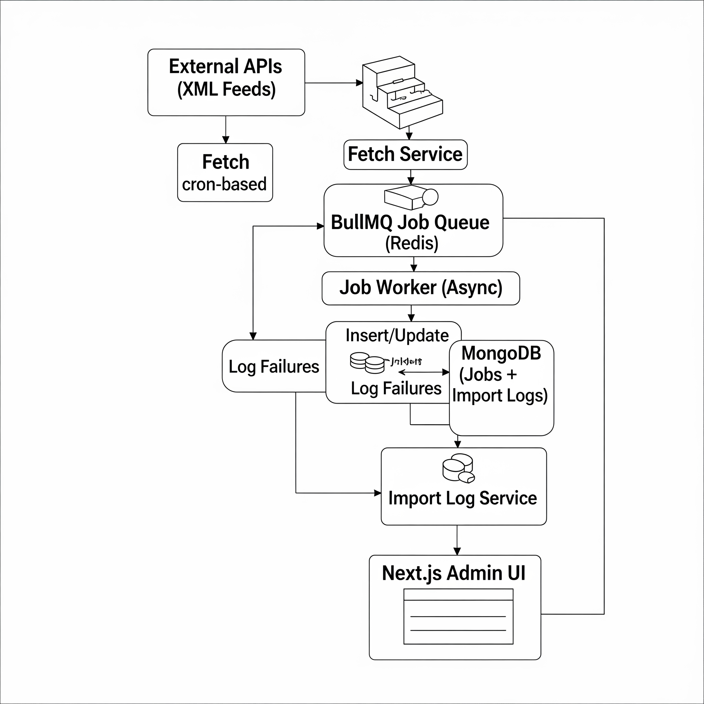

## 📏 Architecture & System Design - Job Importer with Queue Processing & History Tracking.

This document describes the architecture, technology choices, and system behavior of the Job Importer, a scalable background job ingestion system.

## 📊 High-Level Overview

The system is designed to fetch jobs from multiple external XML feeds, convert and queue them, process them asynchronously, store them in MongoDB, and maintain import logs. A frontend dashboard provides visibility into the import history.

## Core Capabilities:

Scheduled job fetching (via cron)

Background queue processing (via Redis + BullMQ)

MongoDB persistence for job data and logs

Admin dashboard to view import history

## 🔧 Tech Stack & Tools

    # Frontend
        Next.js (App Router), Tailwind CSS

    # Backend
        Node.js, Express.js

    # DB
        MongoDB (Mongoose)

    # Queue
        BullMQ (based on Redis)

    # Queue Store
        Redis

    # Cron Jobs
        node-cron

    # Container
        Docker + Docker Compose

## 🌐 System Architecture Diagram

## 🔄 Data Flow Breakdown
Cron Schedule: Runs every hour (or every minute in dev).

Feed Fetch: Fetches multiple XML job feeds and converts them to JSON.

Queueing: Each job is sent to BullMQ queue (jobQueue).

Worker Processing: Jobs are processed by a worker:

If job exists: update

Else: insert new

If error: log failure

Logging: Summary of each run (fetched, new, updated, failed) is saved in import_logs.

Frontend: Fetches logs from /api/import-logs and displays them

## 💡 Design Decisions
BullMQ over alternatives: Offers modern APIs, event-based handling, and better Redis integration.

MongoDB: Schema flexibility is ideal for variable job formats.

node-cron: Simple and effective for interval-based fetch logic.

Next.js App Router: Cleaner routing, better layout handling.

Dockerized: Ensures isolated, reproducible environments.

## 🚀 Scalability Considerations
Queue-based architecture allows job processing to scale horizontally.

Redis and Mongo can be moved to cloud-managed services (Redis Cloud, MongoDB Atlas).

Workers can be deployed independently.

Feed sources can be dynamically extended.

Logs provide visibility into data quality and job performance.

